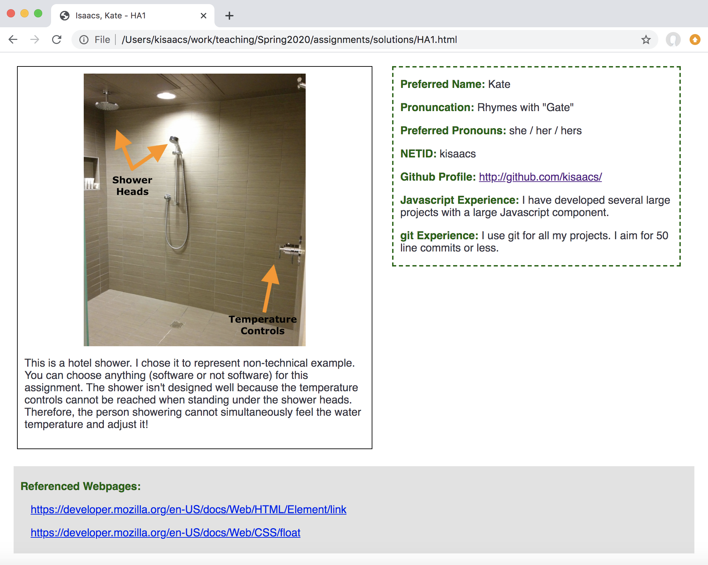

## Homework Assignment 1

History:

- Released, 2020/01/14

In this assignment we are:

- Thinking about how design affects your life
- Providing the instruction staff with basic information about yourself
- Demonstrating use of HTML and CSS

Create a simple webpage using only HTML and CSS. Do not use any Javascript or
Javascript libraries. Style/presentation should be in a separate CSS file. No
style information should be in the HTML tags. Do not use HTML tags like
`
`, `<b>`, or `<i>` to alter visual appearance. HTML tags should be
used as appropriately to describe the *content*.

Use the following link to create your github repository for this assignment:
TBA
<!-- [https://classroom.github.com/a/xJxUP7vR](https://classroom.github.com/a/xJxUP7vR) -->.
At the time of submission, your git repository should contain one HTML file
named `HA1.html` as well as a CSS file names `HA1.css` and an image file.
Please create these files as part of the assignment.

The webpage should consist of two side-by-side columns sitting on a
page-spanning column. All elements should have a minimum of ten pixels of
spacing between each other and the edges of the browser. Use a twelve point
sans serif font. Text should use the color `#343343` unless otherwise noted.
The title of the webpage should be "Last Name, First Name - HA1" where your
last name and first name are used.

This assignment will be graded based on adherence to the specifications in
terms of both content (e.g., image, questions about image, answers to labeled
questions), style (e.g., spacing, boxes, borders, fonts), and constraints
(e.g., no style in HTML).

#### Upper Left Column

The first column should be 500 pixels wide. In it should be a single box with
a one pixel black border with a solid line. There should be at least ten
pixels of spacing between the border and anything inside of it. Within the box
there should be:

- Top, centered: An image of something from your life that is not designed
  well (e.g., difficult, frustrating, or clumsy to use), showing why you
believe it is not designed well. The "something" can be software but does not
have to be. The image should appear no more than 400 pixels wide nor high on
the page.  Clicking on the image should navigate to the full image. The image
should be included in the repository, do not link it from another website.

**You should choose something from your own life experience -- something you
have noticed or used yourself. You should be able to explain what's wrong from
personal experience. You can take you own photographs or you can search for a
pre-existing photograph of that thing, but you should avoid just searching for
"poor design" online. If you use a pre-existing photograph or drawing that you
did not make yourself, it should be properly cited.**

**These images may be used as examples in class, typically with a small credit
to you. If you would like your image to be anonymous (your name is not
associated) OR if you would be uncomfortable with its use at all, please make
a note in the description above.**

- Underneath the image, left justified: Text explaining (1) what the image is
  showing, (2) why you chose it, and (3) why it isn't designed well.

#### Upper Right Column

The second column should be 400 pixels wide. It should be separated from
the first column by at least 25 pixels. 

It should contain a box with a two pixel `darkgreen` border with dashed lines.
There should be at least ten pixels of spacing between the border and anything
inside of it. The box should be aligned with the top of the dashed box in the
first column. Inside the box, include each label below in bold `darkgreen` with
your answer in a normal weight font:

- Preferred Name
- Pronunciation of your Preferred Name
- Preferred Pronouns
- NETID
- Github Profile
- Javascript experience
- git experience

The Github Profile response should be a clickable link to your Github profile.

Your Experience with Javascript and git can be "None" if you do not have any.
If you have seen these in a class, please state so and how big a project you
have worked with using these technologies.

#### Bottom Full-Width Column

Underneaeth the two other boxes should be another box that spans the entire
webpage except for the space from the left or right of the browser window. It
should be aligned to start the same distance from the left of the browser as
the box above it does. A similar distance should be used between the top of
the box and the ones above it.

The box for this column should have no border. It should have a `#E2E2E2`
background. There should be at least 10 pixels of spacing betweenn the edge of
this box and anything it contains. 

It should contain one label in `darkgreen` bold as follows:

- Reference Webpages

Any webpage you looked at to help you complete this assignment (e.g., a
specific StackOverflow answer or a particular MDN link) should be listed under
"Referenced Webpages". Each webpage listed should be a clickable link. The
list should be indented 15 pixels as in the sample below:

If you looked at offline resources, like a book, create a link to that book
either on their publishers website or the UA library.  If you did not look at
any references, list `None`, which should also be indented as if it were a
website. 

