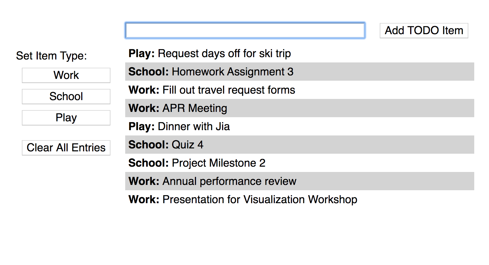

## Homework Assignment 2

Version History: 

- 2020/01/29: Released

In this assignment, we are exercising:

- GUI programming in HTML/CSS/Javascript
- the MVC design pattern

Note this assignment is not about UI design. We are practicingg with
HTML/CSS/Javascript and the MVC pattern dsicussed in class. We will consider
better designs later this semester.

Do not use any Javascript libraries. The HTML, Javascript, and CSS should be
in separate files. No style information should be in the HTML tags. Do not use
HTML tags like `
`, `<b>`, or `<i>` to alter visual appearance.
Programmatically added SVG elements may have style attributes.

This assignment is due Friday, February 7th at 11:59 PM.  Use the following
link to create your github repository for this assignment:
[https://classroom.github.com/a/JwRHEbuA](https://classroom.github.com/a/JwRHEbuA)
This will be initialized with the JS file `HA2.js.` Your git repository at the
time of submission should contain one HTML file named `HA2.html` as well as a
CSS file `HA2.css` and a JS file `HA2.js`.

The webpage should consist of a set of controls and a grid drawing area. The
title of the webpage should be "Last Name, First Name - HA2" where your last
name and first name are used.

### TODO List

In this assignment, we are creating a simple TODO list as shown in the image
above. 

This assignment should be implemented such that the MVC design pattern, as
demonstrated in class, is followed. Your repository will be pre-populated with
a Javascript file with the functions you should use to create this. You will
need to fill in the JS code, as well as create the HTML and CSS files.

#### Functionality

A TODO list item can be added using a text input (top) and clicking the `Add
TODO Item` button. On click, the item is added to the top of the TODO list and
the text input is cleared. Empty items should not be added to the list. On
load, the TODO list should be empty. 

Note that each item is associated with one of three categories: `Work`,
`School`, or `Play`. The item will have the category associated with the last
category button clicked. On load, the default category is `Work`. Switching
the category should not clear the text input. 

Items can be removed by clicking on their row directly. The entire TODO list
can be cleared by clicking the `Clear All Entries` button. This will also
clear the text input if there is text there.

**A video showing some of these functions is available in the `videos`
directory.** 

#### Style

There should be at least 10 pixels between the edges of the browser window and
your elements.

All text, including that in the text input, should be 14pt sans-serif. As
demonstrated in class, you may need to add a `-webkit-appearance: none;` or
other line to your CSS depending on the browser and OS you use.

The category and clear buttons should be on the left as shown. They content
should start beneath the text input control vertically (but too the left of
it). There should be a label `Set Item Type:`. All buttons in this column
should be 150 pixels wide with centered text. There should be 25 pixels of
space between the clear button and the others.

The text input should be 400 pixels wide.

There should be at least a 10 pixel margin around any button.

Items in the TODO List should appear with their category in bold followed by a
colon and a space, then the item itself. The list should alternate between a
white and lightgray background with at least 5 pixels spacing around it so the
text appears centered in the background rather than touching the sides.

### Organization

Your Javascript code should demonstrate the Model-View-Controller pattern as
we went over in lecture. 

The application and state data should be kept by the Model which notifies any
Views upon change.

Any changes to the DOM should be managed by the View. However, the view should
not maintain state between renderings.

The Controller should act as the mediator, making changes to the model as
notified by the View. The Controller does not modify the View.

### Grading

This homework assignment will be graded on adherence to MVC and the given
starter code, functionality, and style with approximate weights of 45%, 35%
and 20% respectively. (These are approximate because it can be argued what
items should be counted in one category versus another. For example, the
functionality is required to demonstrate the MVC and the MVC is required to
make the functionality work.)
