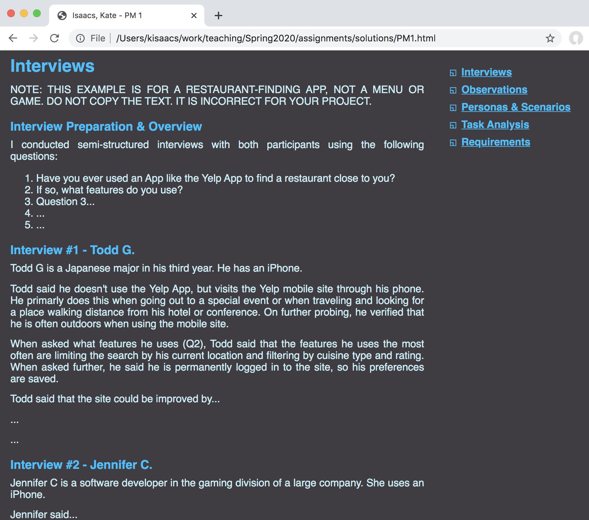
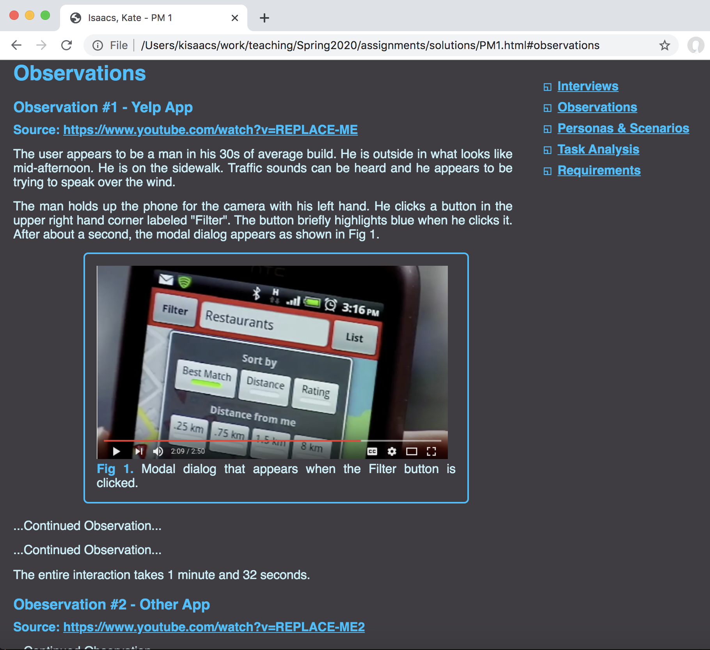
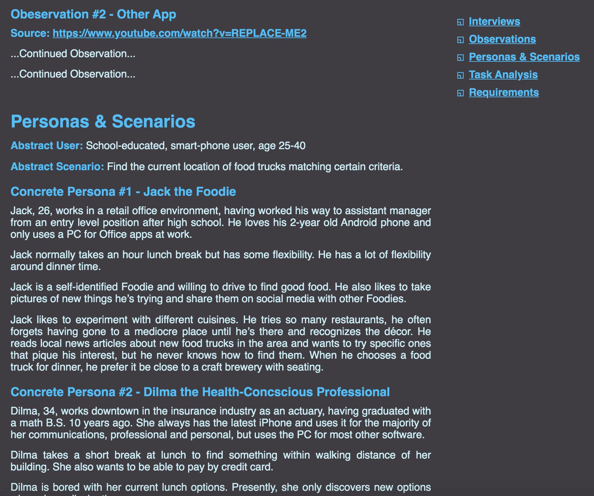
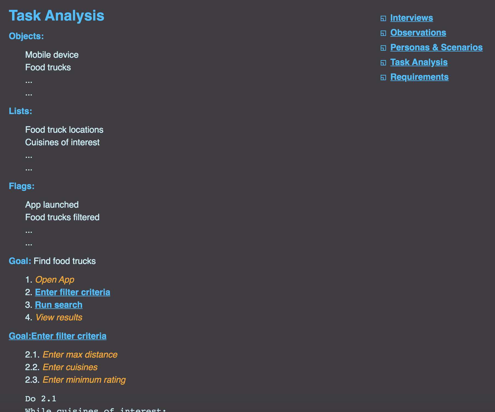
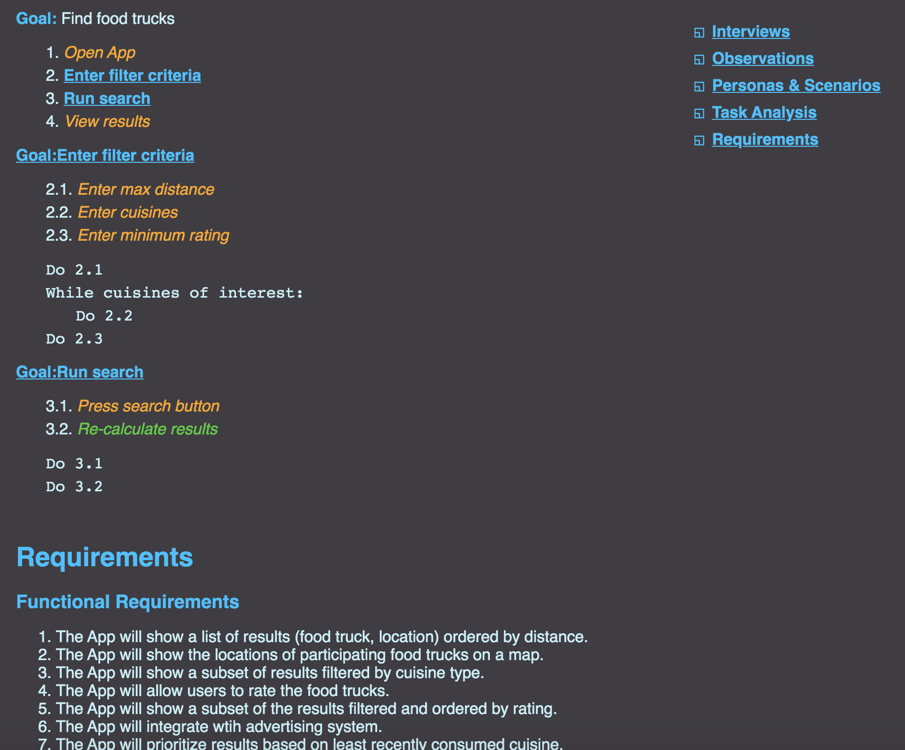

## Project Milestone 1

Version History: 

- Released 2020/1/14


In this milestone we are:

- Choosing your project for the semester.
- Gathering data to support the creating of initial project requirements
- Performing User and Use analysis for the project 
- Stating initial requirements
- Getting a little more HTML practice.

You have a choice between two projects:

- MENU: a stand alone ordering interface for a restaurant, such as those seen
  locally as places like On Deck Deli, Panera and Jimmy's Pita and Poke.
- GAME: an inventory management interface for a video game, such as those seen
  in the Borderlands series, Kingdom Hearts series, and many role-playing games.

**This choice will carry through all of your project milestones. You will not
be able to change projects after this selection.**

The artifacts generated should be presented in a single HTML page as described
below. No style information should be in the HTML tags. Do not use HTML tags
like `<center>`, `<b>`, or `<i>` to alter visual appearance. If you use a tag,
it should be appropriate to the content described.

Use the following link to create your github repository for this assignment:
[https://classroom.github.com/a/JSD2B7Jb](https://classroom.github.com/a/JSD2B7Jb).
At the time of submissions, your git repository should contain one HTML file
named `PM1.html` as well as a CSS file. It should also include any images or
media needed for the report and `PM1.html`.

## Content

### Data Gathering 

#### Interviews (18 pts)

Conduct a short interview with two people not in this class regarding their
use and interest in the project subject matter (ordering kiosks or games with
inventory). 

Document the type of interview you chose and what preparation (e.g.,
questions) you developed prior to the interview.  These should go under a
subsection header `Interview Preparation & Overview`.

Document each interview by describing the person interviewed and the relevant
answers you received from the interviewee. Each interview report should be
preceeded by a sub-section header `Interview #1 - Interview Name` or `Interview
#2 - Interview Name`. You do not need to include the interviewee's real name.
You can instead go with a short description to differentiate them, for example
`Interview #1 - CS Student.`

All Interview content should be under the Section Header `Interviews`.

Interview content will be graded based on correctness in describing the type
of interview, preparation, appropriateness of questions, and completeness of
data gathered: No Answer, Minimally Detailed, Detailed, Thoroughly Detailed.

#### Observations (18 pts total, 9 pts each observation)

Conduct two observations of people using the chosen interface for your
project. Do not observe people without permission. Do not do anything that
will make things difficult for the venue (e.g., restaurant, game club) or get
you in trouble. Do not get in the way of paying customers. You may observe an
online video rather than in-person. However, do not use marketing or review
videos of kiosk systems or games, they should be real people using them in
real settings. If a video is used, the link to that video must be included. 

Observation data should record the who, what, and where questions discussed in
class. They should clearly separate facts from observations. Pay attention to
how quickly the user is able to perform the actions and how many mistakes they
make. Where do they seem to have difficulty? Describe the interface in
question. Use at least one sketched figure or screen shots to help describe
what you observe. (You may sketch a figure on paper and take a photo of it.)
If you are observing a video, greater detail is expected because the video
allows you to pause and replay interactions.

Each observation report should be in a separate sub-section with the title of
the form `Observation #? - Description`. Like the interviews, the description
should differentiate the observations.  If the observation was done off of a
video, a link to the video should be provided next to a bolded, green
`Source:`.  

All Observations content should be under the Section Header `Observation`.

Observation content will be graded on correcteness, appropriateness, and
completeness of data gathered: No Answer, Minimally Detailed, Detailed,
Thoroughly Detailed.

### Analysis

#### Personas & Scenarios (18 pts)

Develop one abstract user, describing the general population served by the
system. Then develop and describe two concrete personas with the main scenario
of using the system for ordering a meal.

Right beneath the section heading, declare the abstract user and abstract
scenario as shown in the sample. 

Each persona should be under its own sub-section header of the form `Concrete
Persona #? - Description` as shown in the sample.

All Personas & Scenarios content should be under the Section Header `Personas
& Scenarios`.

Personas will be graded on appropriateness and thoroughness. The two personas
should be substantially different from one another. 

#### Task Analysis (18 pts)

Perform hierarchical task analysis for the following task depending on the
project you chose:

- MENU: Ordering a meal. 
- GAME: Choosing an piece of armor/accessory to equip. 

Describe the objects, lists, and flags in the domain of your task analysis.
Each list should be titled in bold using the green described below.

Write all of the tasks and subtasks as a list. In the sample, the task numbers
are specified by hand, not with the `ol` functionality. No bullets should be
shown. For each sub-task (including non-leaf sub-tasks), include a plan. The
plans should be below the list for each goal. Each plan should have monospace
text. The title of each node (except the top one) should be a link to its
plan.

Actions in the list which are expanded upon as nodes should be a link to that
node in the HTML page. Actions which do not have nodes (e.g., leaf actions)
should be italic. The color should explain why you chose not to decompose the
node--`orange` means it is an atomic user action, `limegreen` means it is an
atomic system action.

All Hierarchical Task Analysis content should be under the Section Header
`Task Analysis`.

The content of this will be graded on appropriateness of the actions and
decomposition, appropriateness of labeling any action atomic, and
thoroughness.


### Requirements (18 pts)

Create two lists, one for functional requirements and one for non-functional
requirements. Each list should have at least six items. Order each list by
importance--the most important requirements first. In text below the lists,
explain the rationale for your ordering.

Both requirements lists should be numbered, with the type of the requirement
bolded at the top. The rationale should be listed below with the word
"Rationale" bolded and in green. The rationale should cover all the
requirements in the list. Use a sub-section header for both `Functional
Requirements` and `Non-Functional Requirements.` 

All Requirements content should be under the Section Header `Requirements`.

The content will be graded on the appropriateness of the requirements, the
correctness of the categorization of requirements, and the appropriateness and
thoroughness of the rationale for the ordering.

### Formatting (10 pts)

Please write your report in the format described below. Include any formatting
listed above, auch as the use of monospace in the task analysis. 

In your CSS, all rules must follow the indention style:

```
selector {
    property: value;
    property: value;
    .
    .
    .
}

selector {
    property: value;
    property: value;
    .
    .
    .
}
```
Note the selector and its braces appear on separate lines from the properties. Also,
there must be a blank line between each rule.

Your CSS file must be no more than 85 lines long.

We will add any browser-specific adjustments, such as `-webkit-margin-before: 
0;` during grading. It will not count against your 85 lines.

The title should be "FamilyName, PreferredName - PM1" where FamilyName is your
family name and PreferredName is what you prefer to be called.

Your report should have static menu on the right that links to each of the five
content sections: Interviews, Observations, Personas & Scenarios, Task
Analysis, and Requirements. Each link should be preceded by a square
containing another in its lower left quadrant.

The page should have a `#3F3D42` background and `#C5EFF7` text.

Links, headers, image borders, and squares should be `#00BFFF`.

All images should be displayed as figures as follows:
 
- The image will should appear 450 pixels wide.
- There will be a caption of the form `Fig #: Caption text`. The `Fig #:`
  portion should be bold and `#00BFFF`. The rest of the caption should match the
rest of the content text.
- The image and caption will be contained in a 2 pixel solid `#00BFF` border with
  15 pixels between the image/caption and the border.
- The entire figure will be centered within the 640 pixels of content.
- Clicking on an image should diplay the full-sized image.


The main text font should be 12 point sans-serif. All paragraphs should be
justified. The main content should be 640 pixels wide. 

The links in the menu should be
indented 10 pixels. There should be at least 15 pixels of spacing between each
link.

There should be a 30 pixel buffer between the menu and the content. There
should be at least 35 points of space between each section of the content.
Content, starting with Interviews, should start at the top without a large
35 point space.

Section headers should be 20 points and sub-section headers should be 14
point. Both should be bold. There should be 10 points of spacing between each
section header and its content. There should be 7 points of spacing betwen
each sub-section header and its content. There should be 14 points of spacing
between each subsection. There should be 10 points of spacing between each
paragraph.

The Task Analysis, Interviews, and any other lists should have 5 pixels of
spacing between each item and should be indented 30 pixels for each level of
the hierarchy as shown.

Requirements lists should have the default numbered list style.

All links should be the same color as the section headers (both visited and
non-visited links) and underlined.

A movie demonstrating the report format is available [here:
PM1.mov](videos/PM1.mov)

<p align="center">
  
  &nbsp;
  
  &nbsp;
  
</p>

<p align="center">
  
  &nbsp;
  
  &nbsp;
  
</p>


