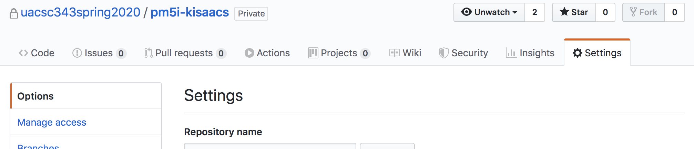
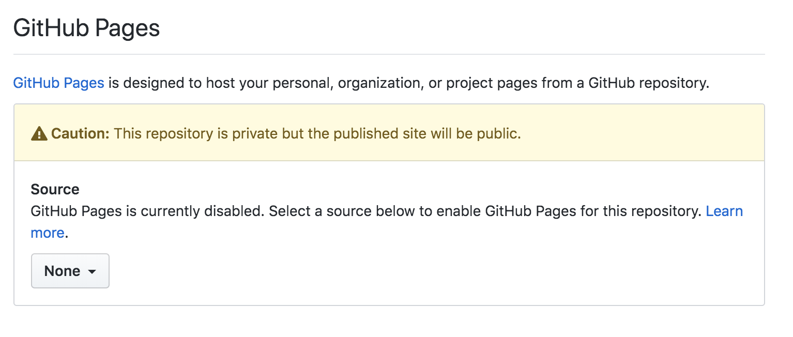
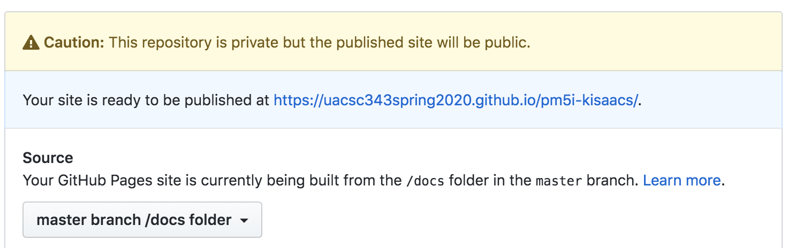
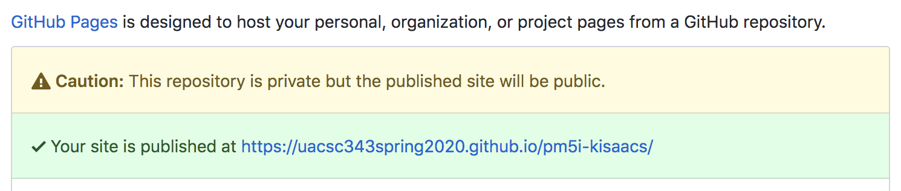

## Project Milestone 6

Version History: 

- Released 2019/4/2

The team portion of this milestone is due Friday April 17, 11:59 PM.

The individual portion for this milestone is due half an hour later, Saturday April 18, 0:29 AM.

In this milestone we are:

- Design an observational evaluation for your functional prototype
- Conduct the observational evaluation you designed.
- Analyzing the results of the evaluation 
- Reporting on the results of your analysis
- Individually stating your contributions and the contributions of your team
  members to this milestone.

**Changes from PM4**
- Explanations of changes from PM4 in addition to explaining the design are
  required.
- The distribution of points has changed.

The artifacts generated should be presented in a single HTML page as described
below. No style information should be in the HTML tags. Do not use
HTML tags like `<center>`, `<b>`, or `<i>` to alter visual appearance.
Programmatically added SVG elements may have style attributes.

**You are creating three repositories this time!**

Create a team DEMO repository:
[https://classroom.github.com/g/b_LzO3rG](https://classroom.github.com/g/b_LzO3rG).
At the time of submission this repository should contain a file `index.html`
which is the starting point for your interface. It should also contain any
other CSS files, Javascript files, imagge files, or media needed to
demonstrate the interface. The `index.html` and other files should be in the
`docs` directory.

Create a team REPORT repository:
[https://classroom.github.com/g/ecD2Vpx_](https://classroom.github.com/g/ecD2Vpx_).
At the time of submission should contain one HTML file named `PM6-report.html.` It
should also include any CSS files, Javascript files, images or media needed
for the report. 

Use the following link to create your individual github repository for this
assignment:
[https://classroom.github.com/a/LZ39pSfe](https://classroom.github.com/a/LZ39pSfe).
At the time of submission, it should contain a text file named
`PM6-evaluations.txt.` The file should have the content described under
Individual Evaluations below. This is a similar format used in prevous PMs.
The notes on how you may want to
distribute the work are different. 

### DEMO (5 pts)

Upload all the files necessary to run your interface to the DEMO repository.
The `index.html` should be under a directory called `docs`.

Next make this available publicly, following these steps:

**NOTE: I created this demo out of an individual classroom account, but you
should do it out of your team's DEMO repository.**

1. In your teams DEMO repository, go to `Settings`. This will automatically put
   your in the `Options` menu.



2. Scroll down to Github Pages. Change the dropdown from `None` to `master
   branch /docs foldder`



3. The interface will change to `Your site is ready to be published at
   https://uacsc343spring2020.github.io/[demo-teamname]/.` In a few minutes,
your site should be avalable there.



4. If it is not loading, reload the Settings/Options page to check if it has
   been published. If so, try again.

 

**While this is due at the time of the assignment, you may want want to add it
earlier so you can ask people to test your interface remotely at this URL.**

Later, for the project presentation, the class should be able to use your
interface. 


### Conducting the Evaluations

You should conduct the evaluation on one person for each team member.
Therefore, if your group has 3 people, you will conduct 3 evaluations. If your
group has 4 people, you will conduct 4 evaluations. Not every team member must
be present at every evaluation but I expect each team member will participate
in some form in at least one evaluation.

Do not evaluate using other members of the class. It is better to get new
participants rather than to use the ones in PM4.

One way to do the evaluation is through Zoom or other (free to you)
teleconferencing software. Have the participant go to the DEMO site and share
their screen while you ask them to perform the tasks. One of you can be
observing the screen while the other observes the facial expressions for the
participant. If you record this session, please get the participant's consent
ahead of time during the briefing.

The materials related to your evaluation should be included as below:


### Content - Header Information 

At the top of your report, state the names of all the team members as well as
your team name. Also include a link to your electronic prototype (DEMO).

If you had a team member that was unresponsive or one that stated they had to
bow out due to COVID-19 related issues, make a note of it here. 

#### Section I: Observation Design (25 pts)

Create a section that includes your briefing and de-briefing scripts, a
description of your tasks (what you will ask them to do), and a list of your
interview questions for the observation. Each of these four artifacts should
be clearly separated from each other so they can be differentiated. Giving
them subheaders or otherwise labeling them will help.

You will be graded on the appropriateness of these materials. You may include
a Rationale sub-section to explain any choices you made.

**In addition to the observation design, discuss how it does or does not
differ from the observation design in PM4 and why you chose to change the
things you did and keep the things you did not change.**

**The same materials should be used across participants (e.g., briefing,
de-briefing). There can be some variation in tasks, but these should be
explained. Typically the same task is used with all participants**

#### Section III: Observational Analysis (25 pts)

After conducting the observations, analyze the results of the observations and
report on the analysis as described in Lectures 13 and 15.

**There should be enough explanation in this section paired with artifacts in
the appendix for me to understand your data and your analysis process. I
should be able to tell how it was conducted and by how many people as well as
what artifacts were coded.**

#### Section III: Suggestions for Improvement (15 pts)

Based on the analysis of the previous section, create a prioritized list of
suggestions for improvements upon the design. Included in these suggestions
may be design elements that should not change. Explain the prioritization.

#### Appendix: Observation Artifacts (20 pts)

Your observation artifacts should be included in the report. Artifacts can
include raw notes, audio, visual, etc. If you did record audio or visual but
your participants would prefer these not be shared, a transcript should be
included. Each observation session should produce some of its own artifacts
and these should be clearly differentiated from each other so an outsider
(like the grader) can know which artifacts go with which session. You will be
graded on the appropriateness of these artifacts in terms of level of detail
and clear separation of facts from inference.


### Format (5 pts)

The only constraints on the format, other than those described above, as are
in the previous PMs:

- The report should be reasonably readable. For example, black text on a black
  background is not reasonable. 
- The headers should be differentiable from the body text and spacing should
  be used to help readability.
- There should be some persistent way for me to navigate between sections.
- The title should have your group name.  
- The report content should be 640 pixels wide with a 12 point sans-serif
  font for the report text.

### Individual Evaluations (5 pts) 

This content should be written by each individual after the project is
submitted. Please place in a folder named `PM6` in your individual repository.
Please name the file `PM6` (with whatever necessary extention, I recommend
`.txt` or `.md` or `.html`).

At the top of your evaluation, estimate the distribution of work contributed
by yourself and your teammates. You will do this by starting with 20 units for
each members of your team (a total of 60 for a 3 person team, 80 for a 4
person team). You will then apportion the units to yourself and your team
members to indicate distribution. If everyone has 20 unit, that means equal
distribution.

I will assess the distributions listed as well as the contributions described
for balance and may apply a weighting/scaling factor to individual grades to
account for discrepancies. More work does not necessarily mean a higher
grade--taking over the project and influencing others to not participate is
discouraged.


Example:
```
Unit Distribution

Blinky: 17

Pinky: 21

Inky: 22

Clyde: 20

```

The second paragraph should describe what your contributions to the project
milestone were:

```
Individual Contributions -- FamilyName, GivenName

My contributions were...
```

Then, for each of your team members, write a section headed with their name
explaining what their contributions were and rating them on:

1. Quality of Work
2. Timeliness of Work Completion
3. Contributions to Group Discussion
4. Cooperative and Supportive Attitude

Ratings should be one of [Below Expectations, Good, Above and Beyond]. 

Beneath the ratings you may provide more detail explaining your ratings or any
other information I should know.


Example:
```
Peer Assessment -- FamilyName, GivenName

GivenName's contributions were... 

1. Quality of Work: Good

2. Timeliness of Work Completion: Below Expectations

3. Contributions to Group Discussion: Good

4. Cooperative and Supportive Attitude: Good

GivenName did a good job on the paper prototype but was two days later than we
planned so we had to scramble to make the movie.
```


### Distribution 

All team members should participate in the discussion of evaluation design,
observations themselves, and suggestions for improvement. At least two team
members should participate in the analysis. Each team member should be
involved in at least one evaluation session with a partipant -- either as
facilitator or observer.

The team should strive to apportion equitably. It is up to the team how this
can be done. 

It may help to appoint different people to draft each writing section and then
someone else to check/edit the writing for completeness. Similarly, one person
can be in charge of assembling the webpage and another in charge of checking
it for compliance. 

One way to divide up the observations is to have each team member recruit one
participant and then act as facilitator for that participant and then observer
on someone else's participant. However, if this proves difficult for a team
member, the work can be divided up differently with the team member
participating less in the observations doing more work on the analysis,
writing, and/or web page assembly.
